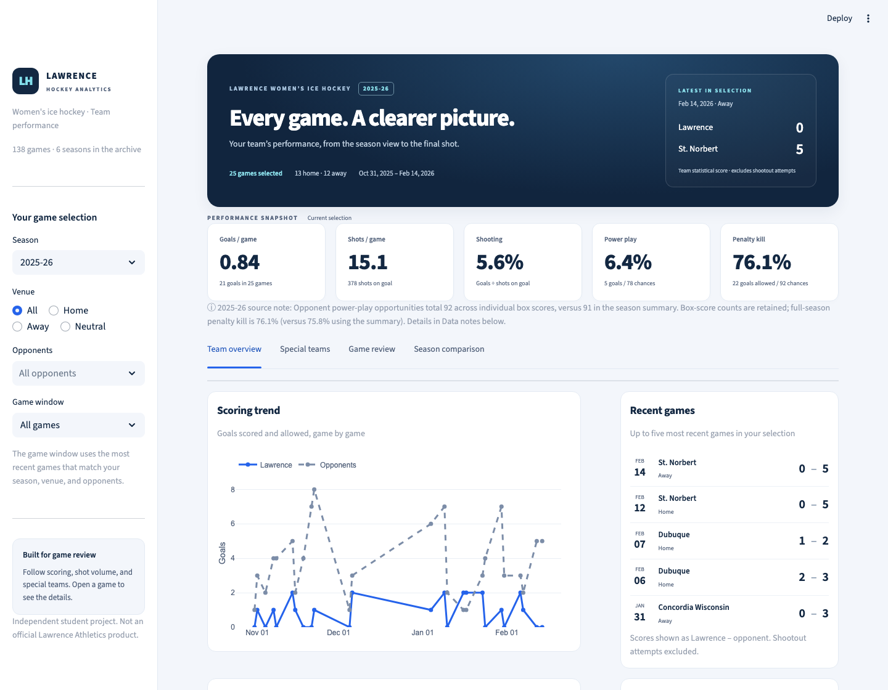

# Lawrence Women's Ice Hockey Performance Dashboard

**Status: In development — 138 games across all six archived seasons (2020–21 through 2025–26).**

An independent student portfolio project analyzing public Lawrence University women's ice hockey game statistics. Not an official Lawrence Athletics product.

## Project question

How do scoring, shooting efficiency, and special-teams performance vary across games and between home and away locations?

## Dashboard

The dashboard is designed for coaches and players, with a navy and ice-blue visual theme, team performance cards, and four views:

- **Team overview:** scoring and shot trends, recent games, and scoring by venue.
- **Special teams:** power-play and penalty-kill rates, with game-by-game opportunity breakdowns.
- **Game review:** an individual game's team comparison, original box-score link, readable game log, and filtered CSV download.
- **Season comparison:** goals, shots, shooting, and special-teams rates across all six full seasons, with opportunity-data coverage.

Filter by season, venue, opponent, and the most recent 5 or 10 matching games. The performance cards and first three tabs reflect that selection; Season comparison always shows full archived seasons across all venues and opponents. Statistical scores exclude shootout attempts; official overtime/shootout outcomes are not yet recorded. Documented source conflicts remain visible. Missing opportunity counts produce N/A rates, and special-teams charts show their coverage when omitting incomplete games.

The included data is sufficient for these team views. See the [coaches and players data plan](docs/dashboard-data-plan.md) for the player statistics, ice time, and event data needed for future features.



## Stack

Python, pandas, SQLite, SQL, Streamlit, and Plotly. Work in VS Code; Excel is not required.

## Start on macOS

Open this folder in VS Code, then choose **Terminal → New Terminal**.

```bash
python3 -m venv .venv
source .venv/bin/activate
python -m pip install -r requirements.txt
python -m src.prepare_data
python -m streamlit run app.py
```

Streamlit prints a local browser URL. The dashboard displays the included six-season data after preparation. Stop it with Control-C.

To regenerate the database from the included records, run:

```bash
python -m src.prepare_data
python -m streamlit run app.py
```

See [the first-session guide](docs/getting-started.md) and [data dictionary](docs/data-dictionary.md).

## Files and their responsibilities

| Path | Purpose |
| --- | --- |
| `app.py` | Interactive dashboard; reads the SQLite database |
| `assets/dashboard.css` | Dashboard layout, typography, colors, and responsive styling |
| `src/prepare_data.py` | Validate CSV records, sort games, write clean CSV and SQLite |
| `data/raw/games.csv` | 138 game records with individual box-score source links |
| `data/reference/` | Season reconciliation totals and record-level quality issues |
| `src/metrics.py` | Rates with missing-data safeguards |
| `tests/` | Historical coverage and calculation regression tests |
| `data/processed/` | Generated outputs; ignored by Git |
| `sql/analysis.sql` | Queries for location, special teams, and opponents |
| `docs/getting-started.md` | Beginner-friendly setup and collection workflow |
| `docs/data-dictionary.md` | Column definitions and calculation rules |
| `docs/dashboard-data-plan.md` | Prioritized data needs for coaches and players |
| `docs/findings.md` | Template for evidence-based findings |
| `docs/sources.md` | Source and collection log |
| `requirements.txt` | Python dependencies |
| `.streamlit/config.toml` | Dashboard colors |
| `.gitignore` | Excludes local environment, secrets, and generated outputs |

## Data flow

Verified box scores → raw CSV → Python validation → clean CSV + SQLite → SQL analysis and dashboard.

## Milestones

- [x] Create initial project scaffold.
- [x] Set up Python and open the dashboard locally.
- [x] Collect 138 games across all six archived seasons.
- [x] Reconcile goals, shots, and power-play goal totals for every season.
- [ ] Resolve missing opportunity counts and documented 2021–22, 2024–25, and 2025–26 source conflicts.
- [ ] Run and explain each SQL query.
- [ ] Write three findings with sample sizes and limitations.
- [x] Add a dashboard screenshot.
- [ ] Add a public demonstration link.

## Method and limitations

Use only public game statistics. Preserve box-score URLs and log corrections. Rates use summed numerators and denominators, not average per-game percentages. A zero denominator yields N/A (SQL NULL). Missing opportunity counts are retained as SQL NULL; affected rates show N/A. Other required statistics still block import when missing. Never replace unknown values with zero. For shootout games, record official team statistical goals, excluding shootout attempts; verify against cumulative totals. Do not infer causes or coaching effectiveness from simple comparisons. Different opponents and small samples can affect home/away results.

No analysis findings or deployment are included yet. See `docs/sources.md` for collection details and source discrepancies. Dependency ranges are specified but are not a lockfile.

## Historical coverage

| Season | Games | Home | Away | Neutral | Missing Lawrence PP opportunities | Missing opponent PP opportunities |
| --- | ---: | ---: | ---: | ---: | ---: | ---: |
| 2020-21 | 9 | 4 | 5 | 0 | 5 | 5 |
| 2021-22 | 23 | 11 | 12 | 0 | 13 | 13 |
| 2022-23 | 27 | 10 | 17 | 0 | 1 | 1 |
| 2023-24 | 27 | 12 | 15 | 0 | 2 | 3 |
| 2024-25 | 27 | 9 | 17 | 1 | 1 | 0 |
| 2025-26 | 25 | 13 | 12 | 0 | 0 | 0 |

23 games have at least one missing opportunity field. See [sources and limitations](docs/sources.md) before interpreting special-teams rates. Use the Season filter and season comparison table to explore the archive.

## Update an existing checkout

```bash
git pull --ff-only
source .venv/bin/activate
python -m src.prepare_data
python -m streamlit run app.py
```

Stop a running dashboard with Control-C first. Regenerate the database after pulling; it is intentionally not tracked in Git. If Git reports local changes that would be overwritten, preserve them before pulling.

## Tests

```bash
python -m unittest discover -s tests -v
```
